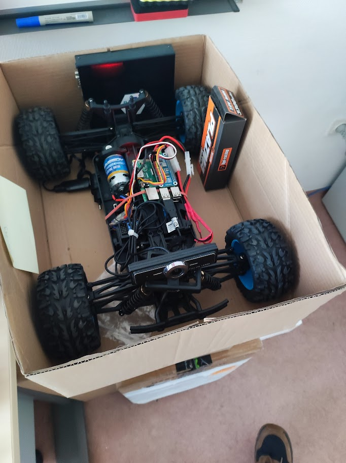

# picar

## First steps
Create a python3 venv:
```bash
python3 -m venv .venv
```

Use the prepared python3 venv:
```bash
source .venv/bin/activate
```

Update pip:
```bash
python3 -m pip install --upgrade pip
```

Install packages from **requirements.txt** -  e.g. under a venv
```bash
pip install -r requirements.txt
```

## Starting the server components

Run as root if it does not work with normal user privilages.

First, use the prepared python3 venv:
```bash
source .venv/bin/activate
```

Launch the picar server in a screen:
```bash
screen -S server
./start_cs.sh
```
Detach the screen by pressing Ctrl+a then d.

Launch the bridge server that is the backend of the simple UI:
```bash
screen -S bridge
./start_br.sh
```
Detach the screen by pressing Ctrl+a then d.

## The experimental setup

<p align="center">

<p/>
